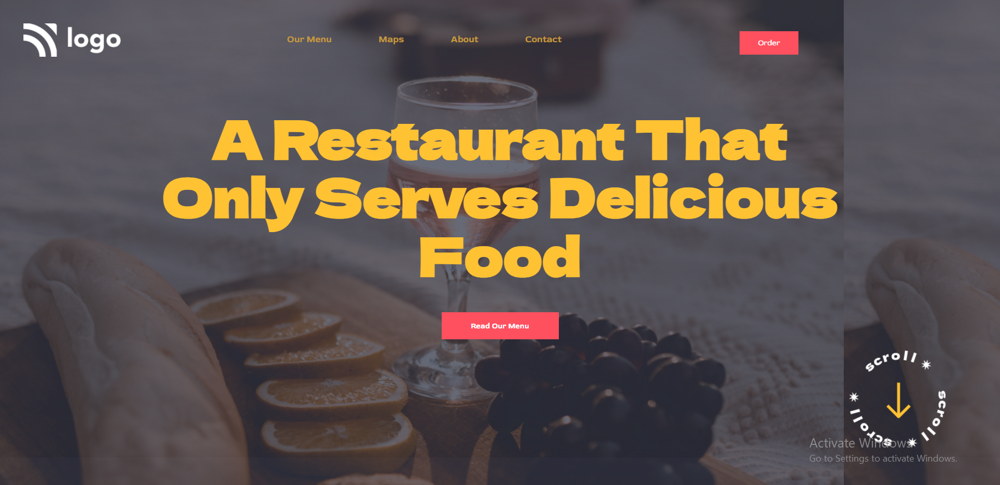

# Portfolio-Style Template Project []

This is basically a one pager Restaurant project made in HTML/CSS.
Hope you like my project !! And as it is not responsive it works well in laptop screen and please zoom in in case of other device.

## Technologies Used
  - HTML
  - CSS

## Demo


## Run Locally

Clone the project

```bash
  git clone https://github.com/suhas-sm/Restaurant-Home-Page.git
```

Go to the project directory

```bash
  cd Restaurant-Home-Page
```
## Features

- UI/UX Design
- One Pager Website
- Background cover

## What i have learnt By working on this project
1. I have improved my self in reserching on the internet
2. Got a good understanding on positions and setting background image


## Honest Time to finish the project

I had took about 1 hours approximately learning how to research things

## Feedback

If you have any feedback, please reach out to us at melmurissm11@gmail.com

